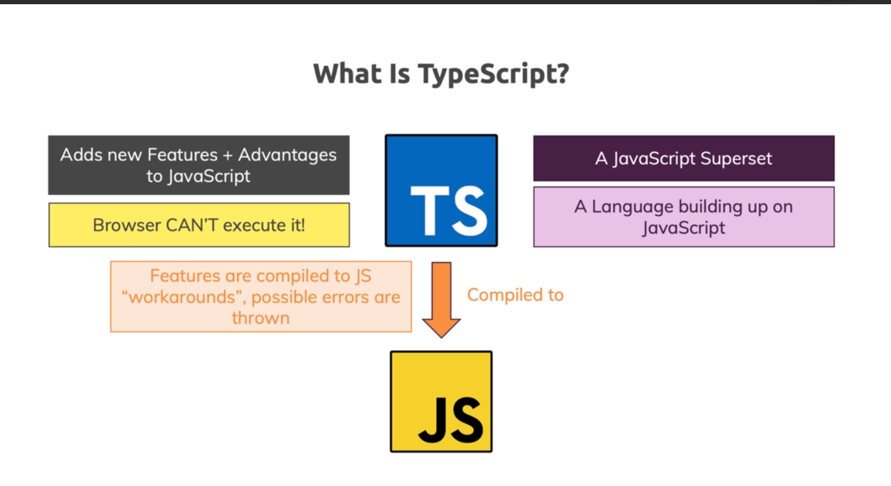

## Typescript

By definition, “TypeScript is JavaScript for application-scale development.”

In short, TypeScript is a superset of JavaScript that has optional typing and compiles to plain JavaScript.



## Features of TypeScript

**TypeScript is just JavaScript**. TypeScript starts with JavaScript and ends with JavaScript. Typescript adopts the basic building blocks of your program from JavaScript. Hence, you only need to know JavaScript to use TypeScript. All TypeScript code is converted into its JavaScript equivalent for the purpose of execution.

**TypeScript supports other JS libraries**. Compiled TypeScript can be consumed from any JavaScript code. TypeScript-generated JavaScript can reuse all of the existing JavaScript frameworks, tools, and libraries.

**JavaScript is TypeScript**. This means that any valid **.js** file can be renamed to **.ts** and compiled with other TypeScript files.

**TypeScript is portable**. TypeScript is portable across browsers, devices, and operating systems. It can run on any environment that JavaScript runs on. Unlike its counterparts, TypeScript doesn’t need a dedicated VM or a specific runtime environment to execute.


### ## What do I need to learn to use TypeScript?

TypeScript is essentially a JS linter. Or, JS with documentation that the compiler can understand.

Therefore, in contrast to other languages like CoffeeScript (which adds syntactic sugar) or PureScript (which does not look like JavaScript at all), you do not need to learn a lot to start writing TypeScript code.

Types in TS are optional, and every JS file is a valid TypeScript file. While the compiler will complain if you have type errors in your initial files, it does give you back a JavaScript file that *works as it did before*. Wherever you are, TypeScript will meet you there, and it is easy to build up your skills gradually.

### Is TypeScript used on the frontend or the backend?

TypeScript is compiled to JavaScript. Therefore, TS can be used anywhere JS could be used: both the frontend and the backend.

JavaScript is the most popular language to implement scripting for the frontend of apps and web pages. Thus, TypeScript can be used for the very same purpose, but it shines in complex enterprise projects on the server side.


### Types of TypeScript

TypeScript has a variety of basic types, like Boolean, Number, String, Array, Tuple, etc. Some of these don’t exist in JS.


## Types


# 


# Interface


# Advanced Types


## Globally Installing TypeScript

It can be handy to have TypeScript available across all projects, often to test one-off ideas. Long-term, codebases should prefer a project-wide installation over a global install so that they can benefit from reproducible builds across different machines.

### via npm

You can use npm to install TypeScript globally, this means that you can use the `tsc` command anywhere in your terminal.

To do this, run `npm install -g typescript`. 


## TypeScript in Your Project

Having TypeScript set up on a per-project basis lets you have many projects with many different versions of TypeScript, this keeps each project working consistently.

### via npm

TypeScript is available as a [package on the npm registry](https://www.npmjs.com/package/typescript) available as `"typescript"`.

You will need a copy of [Node.js](https://nodejs.org/en/) as an environment to run the package. Then you use a dependency manager like [npm](https://www.npmjs.com/), [yarn](https://yarnpkg.com/) or [pnpm](https://pnpm.js.org/) to download TypeScript into your project.

```
npm install typescript --save-dev
```

npm yarn pnpm

All of these dependency managers support lockfiles, ensuring that everyone on your team is using the same version of the language. You can then run the TypeScript compiler using one of the following commands:

```
npx tsc
```

**Compile**

```tsx
> tsc helloworld.ts
```


# **Enough thoery Lets code**


- ### Static type-checking

[**TypeScript**](https://en.wikipedia.org/wiki/TypeScript) provides **static typing** through **type** annotations to enable **type** **checking** at compile time.

This is optional and can be ignored to use the regular dynamic **typing** of JavaScript.


# <u>**Name dropping <T>: (terms: T)**</u>

Firstly **— What is a Type system?**

> A **type system** associates a type with each computed value and, by examining the flow of these values, attempts to **ensure** or prove that no [type errors](https://en.wikipedia.org/wiki/Type_error) can occur.

Kind of cool having a **set of rules** aimed to reduce possibilities of bugs isn’t it?

**Static typing:** Types **checked before run-time** (tracking bugs before shifting your code..).

**Dynamically**-**typed:** Type **checked** mostly at **run time.** (runtime issues are more expensive if missed).

BTW the mix combination of both strongly and weekly typing (like when using ***any\***) is called: “**gradual typing**.”

**Type annotations:** (just a fancy name to something your’e familiar with..) used to enforce type checking. e.g as is (object with members) or using the type / interface declarations.

```
function drive(driver: {name: string, age: number}, 
               car: { brand: string, maxSpeed: number }) {
}

// OR

type Driver = {name: string, age: number};

// OR 

interface IDriver {
  name: string;
  age: number
}
```

**Structural typing:**

I recently watched the ***TypeScript: Static Types for JavaScrip\***t lecture by ***Anders Hejlsberg\***, it’s really good and he explains TS as a Structural type system

> **Structural** typing is a way of relating **types** based solely on their members.

Relate types based on their members? The following shows possibly 2 different types but both have the same members thus could be assigned one to the other:

```
interface INode<T> {
  data: string;
  parent: T;
  children: INode<INode<T>>[];
}

type Item<T> = {
  data: string;
  parent: T;
  children: Item<Item<T>>[];
}let foo: INode<null>;
let bar: Item<null>;

foo = bar;
```

> The basic rule for TypeScript’s structural type system is that `x` is compatible with `y` if `y` has at least the same members as `x.`


### `noImplicitAny`

According to the documentation, the definition of `noImplicitAny` is to “raise errors on expressions and declarations with any implied any type.”

This means that whenever TypeScript can infer a type, you will get an error if you allow `noImplicitAny`. This example can be seen by passing function arguments.


`function print(arg) {`

`send(arg);` 

`}`

`print("hello");`

`print(4);`

In the above code, **what are valid arguments for the `print` function?** If you don’t add a type to the function argument, TypeScript will assign the argument of type `any`, which will turn off type checking.

For developers who prefer safety in their code, they can utilize `noImplicityAny`, which will notify them of any possibilities for type `any` in their code. Let’s see what will happen with the same `print` function.

`function print(arg) { // Error : someArg has an implicit any type`

​    `send(arg);`

`}`

To fix the error, you can annotate the function argument.

`function print(arg: number) { // Error : someArg has an implicit any type`

​    `send(arg);`

`}`


But if you still want type `any`, you can explicitly mark the argument as `any`.

`function print(arg: any) { // Error : someArg has an implicit any type`

​    `send(arg);`

`}`

### `unknown`

The `unknown` type is similar to the `any` type in that all types are assignable to the `any` and `unknown` type, but the distinction is that the `any` type is assignable to any other types, but the `unknown` type is un-assignable to any other type. The distinction can be a confusing concept, so let’s take a look at an example.


`function example1(arg: any) {`

 `const a: str = arg; // no error`

 `const b: num = arg; // no error`

`}`

`function example2(arg: unknown) {`

 `const a: str = arg; // 🔴 Type 'unknown' is not assignable to type 'string'.(2322)`

 `const b: num = arg; // 🔴 Type 'unknown' is not assignable to type 'number'.(2322)`

`}`


A variable `arg` is passed to both functions, which can have a type of `string`, `number`, or another type. No matter its type, `arg` is then assigned the type `any` and `unknown`.

However, unlike the `any` type, a variable of `unknown` type cannot then be assigned to another type, as seen in lines 7 and 8. The `any` type is bidirectional, whereas `unknown` is unidirectional.

The `unknown` type can be helpful in cases where you don’t know the type of a value you are passing into a function but would like to get rid of the `any` cases. This increases the safety of your code, as the `any` type can propagate, making your codebase more prone to errors.


### `strictNullChecks`

In TypeScript, `null` and `undefined` are assignable to every type, meaning that they are in the domain of all types.


`let num: number = 123;`

`num = null; // Okay`

`num = undefined; // Okay`


Oftentimes, this can lead to unexpected errors, as you can call methods on a variable whose value is `null` or `undefined`.

`interface Person {`

 `hello(): void;`

`}`

`const num: number = undefined;`

`const str: string = null;`

`const person: Person = null;`

`person.hello(); // 🔴 Runtime Error!`


In strict null checking mode, `null` and `undefined` do not automatically belong to all types, and therefore you can’t use them for a type that doesn’t include `null` or `undefined`. This way, you can get an error at compile time that says `Object is possibly 'undefined'`.

# TypeScript - Type Annotations

```tsx
var age: number = 32; // number variable
var name: string = "John";// string variable
var isUpdated: boolean = true;// Boolean variable
```

#### The following example demonstrates the type annotation of paramters.

```
function display(id:number, name:string)
{
    console.log("Id = " + id + ", Name = " + name);
}
```

#### Similarly, we can declare an object with inline annotations for each of the properties of the object.

```tsx
var employee : { 
    id: number; 
    name: string; 
}; 

employee = { 
  id: 100, 
  name : "John"
}
```

### Union type

Oftentimes, you may want your code to allow more than one data type. This need is especially true when accepting a `null` or `undefined` value. The **union type** can solve this problem, which is denoted by the `|` annotation.

`const hello = (name: string | undefined) => { /* ... */ };`


In this example, the type `name` is defined as `string | undefined`, meaning that any variable of type `name` can either be a `string` or `undefined`.

### Intersection type

An intersection type combines multiple types into one, such that the new type has the features of the combined types. You can do this through the `extend` keyword, as seen below.

`function extend<T, U>(first: T, second: U): T & U {`

 `return { ...first, ...second };`

`}`

`const x = extend({ a: "hello" }, { b: 42 });`

`// x now has both a and b`

`const a = x.a;`

`const b = x.b;`


### Tuple type

Unlike JavaScript, TypeScript offers Tuple types, which allow you to express an array with non-uniform types and a fixed number of elements. A tuple is demonstrated in the below example.

`var nameNumber: [string, number];`

`// Okay`

`nameNumber = ['Ben', 12345];`

`// Error`

`nameNumber = ['Ben', '12345'];`


#### <u>We must know things on TypeScript</u>

## 1. TypeScript Code is Converted into Plain JavaScript Code

TypeScript code consists of plain JavaScript code as well as certain keywords and constructs specific to TypeScript. However, when you compile the TypeScript code it is converted into plain JavaScript. That means the resultant JavaScript can be used with any browser that supports JavaScript. For example, consider the following code written in TypeScript:

```
class Customer {
    customerId: number;
    companyName: string;
    contactName: string;
    country: string;

    addCustomer(): number {
        //some code here
        return 0;
    }
}
```

The above code uses TypeScript specific keywords such as *class* and data types such as *number* and *string*. When you compile this code the resultant JavaScript that gets outputted is this:

```
var Customer = (function () {
    function Customer() { }
    Customer.prototype.addCustomer = function () {
        return 0;
    };
    return Customer;
})();
```

As you can see this is just the plain JavaScript and can be used in any browser that understands JavaScript. In your web pages you will be referring to this JavaScript code file (*.js) and not the TypeScript code file (*.ts). To compile the TypeScript code to JavaScript you have two options – you can either use the command line TypeScript compiler (tsc.exe) or you can use the TypeScript editor plugin for Visual Studio 2012. The later is highly recommended because it provides additional features such as IntelliSense and syntax highlighting.

## 2. Data Types

When you declare any variable in JavaScript you typically do so using var keyword without specifying any particular data type for the variable. For example consider the following variable declaration:

```
window.onload = function () {
    var data = 10;
    alert(data);
    data = "hello world";
    alert(data);
}
```

In the above piece of code, variable named data is first assigned a number and then a string. As you might have already guessed both the alert() calls correctly output the respective value. However, this can lead to hard to maintain code and can introduce serious errors. TypeScript allows you to declare variables with a specific data type. The types can be classified as primitive or object types. The primitive types include number, bool and string whereas object types include modules, classes and interfaces. The following piece of code shows how this can be done.


Declare variables

As you can see three variables viz. age, message and flag are declared of type number, string and bool respectively. If you try to assign values to any of these variables that are not of the specific type, the TypeScript compiler will throw an error. If you are using TypeScript editor plugin for Visual Studio 2012 you will immediately see a red underline below the line in question. You can omit the type if you declare and initialize the variable in a single step (for example, var age=10; will make age of type number). Types can also be used with function parameters or return values of the functions.

```
MyFunction(message:string,flag:bool): number {
    if (flag) {
        document.getElementById("div1").innerText = message;
        return 10;
    }
    else {
        document.getElementById("div1").innerText = message;
        return 20;
    }
}
```

As you can see, the MyFunction accepts two parameters of type string and bool respectively and returns a number. TypeScript also has a data type called any that can accept any type of data.

By allowing you to declare variables of a specific type, TypeScript avoids lot of errors that may otherwise be introduced in the code.

## 3. Classes

If you develop applications using programming languages such as C# or Visual Basic you are probably aware of the benefit offered by object oriented constructs such as classes. In many web applications developers keep their JavaSript code merely as a collection of functions. TypeScript allows you to easily and neatly organize your code in classes. The following class declaration shows how:

```
class Customer {
    customerId: number;
    companyName: string;

    addCustomer() {
        //some code here
    }

    removeCustomer() {
        //some code here
    }

    updateCustomer() {
        //some code here
    }

    getCustomer() {
        //some code here
    }
}
```

The above code creates a class named Customer using the class keyword of TypeScript. Just like C# classes a TypeScript class can have properties, methods and constructors. Once created you can initialize an object of Customer class as shown below:

```
var obj = new Customer();
obj.customerId = 100;
obj.companyName = "Some Company";
obj.addCustomer();
```

## 4. Access Modifiers and Properties

Access modifiers control the accessibility of the members of a class. TypeScript has two access modifiers – public and private. By default the members are public but you can explicitly add a public or private modifier to them. Consider the following piece of code that declares two public and one private variable.


Two public and one private variable

The above code defines a class named Customer that has three members viz. customerId, companyName and country. Since by default members are public the customerId can be accessed from theoutside world as shown by the IntelliSense window. On the same lines the companyName is explicitly marked as public and hence it is accessible from the external world. The country, however, is marked as private and hence won’t be accessible outside the class as can be seen from the IntelliSense window.

When you declare members as private you may want to allow access to them them via public get and set properties. Luckily TypeScript allows you to do just that. The following code shows how:

```
get Country(): string {
    return this.country;
}

set Country(value: string) {
    this.country = value;
}
```

Here, the get and a set functions for Country property are defined. Inside the get function you return the value of private variable country whereas in the set function you assign a value to it. Once created you can use this property as follows:

```
var obj = new Customer();
obj.Country = "USA";
```

Note that in order to compile the above code correctly you must use –target switch and set its value to ES5 (ECMA script version 5). This is because the property get and set are supported in ECMA5 and later versions (the error thrown at you will be “Property accessors are only available when targeting ES5 or greater”). To compile the above code from the command line you would run the following command:

```
tsc.exe --target ES5 app.ts
```

## 5. Static and Instance Members

The classes you create in TypeScript can either contain static members or instance members. For example consider the following piece of code:

```
class Customer {
    customerId: number;
    companyName: string;
    static data: string;

    static test() {
        alert(Customer.data);
    }
}
```

The above code declares a class named Customer. The Customer class declares a static property – data – of type string. The static function test() then displays this property value to the user. Notice how static members are accessed using <class_name>.<static_member_name> syntax.

## 6. Function Overloading

TypeScript allows you to define overloaded functions. This way you can invoke different implementations of a function depending on the parameter. Remember, however, that TypeScript function overloading is bit odd and requires type checking during the implementation. This limitation is due to the fact that TypeScript code finally gets compiled into plain JavaScript and JavaScript doesn’t support the concept of function overloading in its true sense. The following simple example shows how two versions of a function can be created in TypeScript:

```
addCustomer(custId: number);
addCustomer(company:string);
addCustomer(value: any) {
    if (value && typeof value == "number") {
        alert("First overload - " + value);
    }
    if (value && typeof value == "string") {
        alert("Second overload - " + value);
    }
}
```

As you can see the first two are merely function signatures without any implementation. The first signature has one parameter of type number whereas the second signature has a parameter of type string. The third function contains the actual implementation and has a parameter of type any. The any data type indicates that any type of data can be passed in the parameter. The implementation then has a series of if blocks, each checking the type of the supplied parameter. Accordingly a different piece of code is executed. If you see the IntelliSense for the addCustomer() function it will indicate all the overloaded versions of the function as shown below:


The IntelliSense for the addCustomer() function

## 7. Constructors

The classes you define in TypeScript can have constructor. The constructor usually does the job of initializing the object by setting default values to its properties. The constructor can also be overloaded just like a function. The following code shows how a constructor can be created.

```
constructor(custId:number,company:string,country:string) {
    this.customerId = custId;
    this.companyName = company;
    this.country = country;
}
```

The above code declares a parameterized constructor for the Customer class. The constructor has three parameters and inside the constructor their values are assigned to the respective properties. Once created you can instantiate the Customer class as shown below:

```
var obj = new Customer(100,'Some Company','USA');
alert(obj.country);
```

As you can see the constructor parameters are specified while instantiating the class. There is also one more handy use of the constructor – instead of defining properties explicitly in the class they can be defined in the constructor signature itself. The following code shows how this can be done:

```
constructor(public customerId:number,public companyName:string,public country:string) {
}
```

The above constructor has three parameters and they are marked as public. This way the Customer class gets three public properties, viz. customerId, companyName and country, even if you didn’t explicitly defined them. You can then use these properties just like any other explicitly defined properties.


## 8. Inheritance

TypeScript allows you to inherit from existing classes. By inheriting classes you can extend their functionality as per your requirement. For example, you may have a class named Person. You can create specialized classes based on the Person class by extending it in the other classes (say Employee or Contractor). The following code shows how this can be done.


TypeScript allows you to inherit from existing classes

The above code defines two classes Person and Employee. The Person class has two properties viz. firstName and lastName. The Employee class inherits from the Person class using the extends keyword. Notice how the base class constructor has been called in the inherited class using the super keyword. As shown in the IntelliSense the Employee class in all has four properties – two properties from base class and two properties of its own.

## 9. Interfaces

Just as TypeScript supports inheritance, it also supports interfaces. You can define an interface and then implement it in one or more classes. For example, you may have an interface called ITax that defines some properties and functions. You can then implement ITax in other classes say IncomeTax and ServiceTax. The following code shows how this can be done:

```
interface ITax {
    taxpayerId: string;
    calculateTax(): number;
}

class IncomeTax implements ITax {
    taxpayerId: string;
    calculateTax(): number {
        return 10000;
    }
}

class ServiceTax implements ITax {
    taxpayerId: string;
    calculateTax(): number {
        return 2000;
    }
}
```

As you can see from the above code an interface ITax has been defined using the interface keyword. It has one property named taxpayerId and a function calculateTax(). Then there is a class IncomeTax that implements ITax using the implements keyword. It is mandatory for IncomeTax class to implement taxpayerId property and the calculateTax() method. Similarly, another class named ServiceTax implements ITax.

## 10. Modules

As your TypeScript code base grows it becomes important to organize classes and interfaces for better maintainability. TypeScript modules allow you to do just that. A module is a container for your code that helps you organize your code in a neat way. Conceptually you may find them similar to .NET namespaces. Let’s see how to create a module.

Have a look at the following code that defines a module named Company.

```
module Company {
    class Employee {
    }

    class EmployeeHelper {
        targetEmployee: Employee;
    }

    export class Customer {
    }
}

var obj = new Company.Customer();
```

The above code defines Company module using the module keyword. The Company module contains three classes – Employee, EmployeeHelper and Customer. By default all the classes from a module are accessible only within that module. That is why it is alright to access the Employee class inside the EmployeeHelper class from the same module but you can’t access the Employee class from outside the Company module. If you wish to access a class from a module from the outside world you need to “export” it as in the case of the Customer class.


### Next Session Topics: 

1. Extending Interface
2. Interfaces as Functions
3. Compiling Interfaces
4. Decorators
5. Advanced Types
6. generics
7. Rest and spread operator in Typescript

